# Projet : Déploiement d’une Application Web dans un cluster de 3 serveurs

## Phase 1 : Préparation de l’Infrastructure et Docker Registre

### Étape 1 : Connexion aux VM

> Connexion ssh vers la vm manager1

```bash
ssh manager1
```

> Si besoin copier la clé rsa vers les vm ( Exemple ici avec worker1 qui n'était pas configurer pour ma part, pareil pour worker2 )

```bash
ssh-copy-id -i ~/.ssh/id_rsa.pub worker1
```

### Étape 2 : Construire l’application et compiler l’image Docker

> 1. Copie des fichiers de l'api vers manager1

```bash
cd tp_dock
scp -r ./projet manager1:/home/o22401112
```

> 2. Construire et lancer l'image Docker

```bash
docker image build --tag web_api_application .
docker run --name web_api_application --publish 8000:8000 -d web_api_application:latest
```

> 3. Est-ce que l'application est dans les workers, pourqui ? 

Non l'application n'est pas dans les workers car on a lancer l'image ( et construite que sur la vm manager1 )

> 4. Est-ce que l’application est accessible depuis les workers? Comment?

L'application est accessible depuis les workers depuis une commande curl pour tester si on a une réponses de l'application lancé sur manager1

```bash
curl -X POST http://172.16.1.59:8000/kv/1/2/truc
```

> Screen de la vérification


### Étape 3 : Création d’un Registre Privé

> Création du registre privé

```bash
docker run -d -p 5000:5000 --restart=always --name registry registry:2
```

> Upload de l'image vers le registre privé

```bash
docker tag web_api_application 172.16.1.59:5000/web_api_application
docker push 172.16.1.59:5000/web_api_application
```

> Vérification de l'image dans le registre privée depuis worker1

```bash
curl http://172.16.1.59:5000/v2/_catalog
```

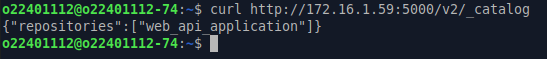


> Ca sert a quoi un registre privé

A partager des images dans un réseau privé

> Pourquoi est-il important dans un environnement de production

C'est important pour ce partager des images entre machine dans un même réseau ( vitesse de pull de l'image plus rapide, partage de l'image que en interne )

## Phase 2 : Déployer l'application sur swarm

### Étape 1 : Initialisation de Swarm

> Initialiser Docker Swarm sur manager1

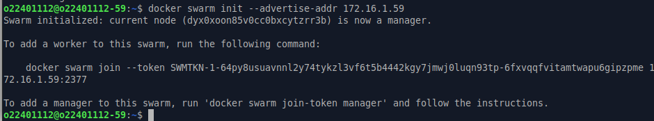

> Joindre les nœuds workers au Swarm

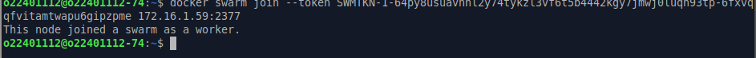

> Vérifier l'installation de swarm

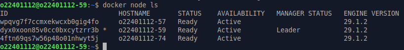

### Étape 2 : Mettre en place un réseau overlay et une volume pour Redis

> Créer un réseau overlay privé sécurisé

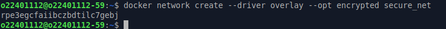

> Vérifier le réseau

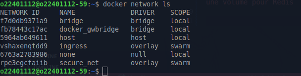

> Créer un volume persistant pour Redis

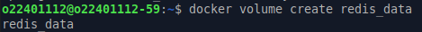

> Vérifier le volume

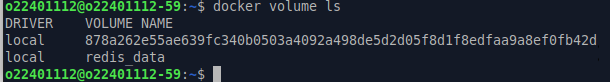

On observe bien que secure_net | swarm est créer et ingress aussi

> Pourquoi est-il important d’utiliser un réseau overlay pour les services de l’application?

Pour permettre une communication sécurisée entre les conteneurs sur différents hôtes au sein du cluster swarm

> Quels sont les avantages par rapport à un réseau bridge?

Permettre la communication entre différent serveur

### Étape 3 : Déployer l’Application sur Swarm

> Maj le fichier /etc/docker/daemon.json comme fait dans le manager1 pour les worker1 et worker2. Consultez la section Notes 01 pour plus d’informations.

> Deployer Redis sur le Swarm: actuellement le redis est sur le manager1. Il faut le deployer sur le Swarm, sinon l’application Flask qui sera deployee sur tous les noeuds du Swarm ne pourra pas communiquer avec le service Redis.

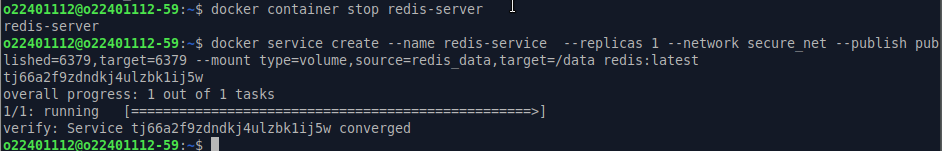

> Vérifier le service Redis

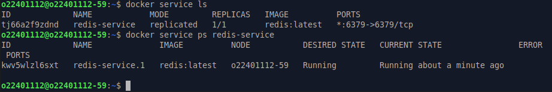

> Vérifier la connectivité avec Redis

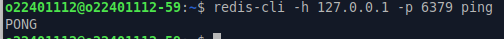

> Maj le code python pour tenir encompte le redis-service : L’application sera deploye comme un service sur le Swarm. Pour que l’application puisse communiquer avec le service Redis, il faut changer l’adresse IP de Redis dans le fichier app.py par le nom du service Redis.

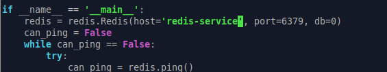

> Verifier si les 2 services sont sur un meme reseau

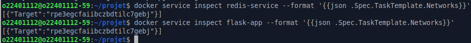

> Vérifier l’application Flask

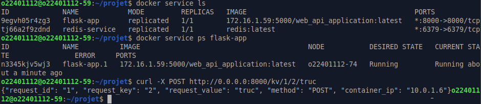

> Scaler l’application Flask

> Vérifier l’équilibrage de charge

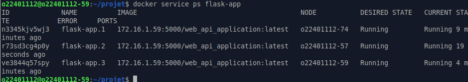

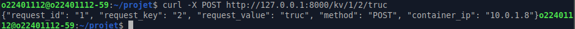

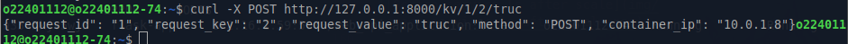

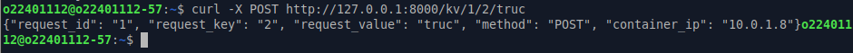

> Pourquoi on a besoin de scaler l’application Flask?

Pour mieux répartir la charge de l'application flask entre le manager et les worker

> Quels sont les avantages de l’équilibrage de charge?

Eviter la surcharge d'un serveur, permettre d'acceuillir plus de requete sur son serveur

> Pourquoi on demarre Redis sur un seul noeud avec replica=1?

Pour que les données soit redondante entre les serveurs, chaque instance de l'application flask a le même serveur redis

> Quels sont les avantages d’utiliser un cluster de plusieurs machines pour déploier votre application aulieu d’utiliser une seule machine?

Mieux répartir la charge, éviter la surcharge d'un serveur

> Quels sont les inconvénients?

Configuration du clusteur