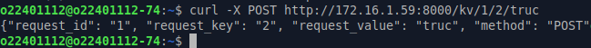

# Projet : Déploiement d’une Application Web dans un cluster de 3 serveurs

## Phase 1 : Préparation de l’Infrastructure et Docker Registre

### Étape 1 : Connexion aux VM

> Connexion ssh vers la vm manager1

```bash
ssh manager1
```

> Si besoin copier la clé rsa vers les vm ( Exemple ici avec worker1 qui n'était pas configurer pour ma part, pareil pour worker2 )

```bash
ssh-copy-id -i ~/.ssh/id_rsa.pub worker1
```

### Étape 2 : Construire l’application et compiler l’image Docker

> 1. Copie des fichiers de l'api vers manager1

```bash
cd tp_dock
scp -r ./projet manager1:/home/o22401112
```

> 2. Construire et lancer l'image Docker

```bash
docker image build --tag web_api_application .
docker run --name web_api_application --publish 8000:8000 -d web_api_application:latest
```

> 3. Est-ce que l'application est dans les workers, pourqui ? 

Non l'application n'est pas dans les workers car on a lancer l'image ( et construite que sur la vm manager1 )

> 4. Est-ce que l’application est accessible depuis les workers? Comment?

L'application est accessible depuis les workers depuis une commande curl pour tester si on a une réponses de l'application lancé sur manager1

```bash
curl -X POST http://172.16.1.59:8000/kv/1/2/truc
```

> Screen de la vérification



### Étape 3 : Création d’un Registre Privé

> Créatio du registre privé

```bash
docker run -d -p 5000:5000 --restart=always --name registry registry:2
```

> Upload de l'image vers le registre privé

```bash
docker tag web_api_application <manager1-ip>:5000/web_api_application
docker push <manager1-ip>:5000/web_api_application
```